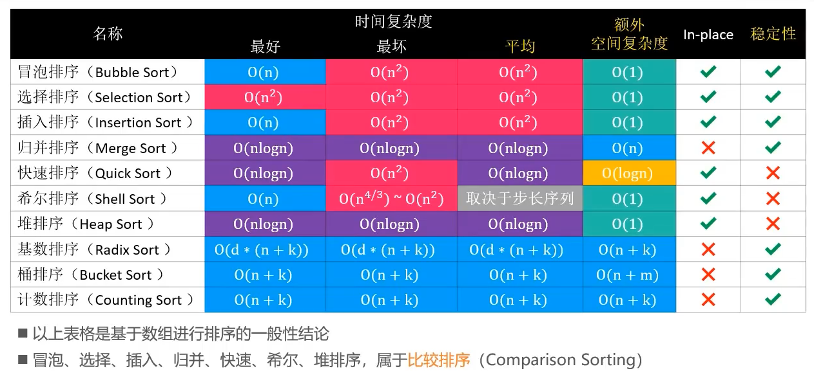
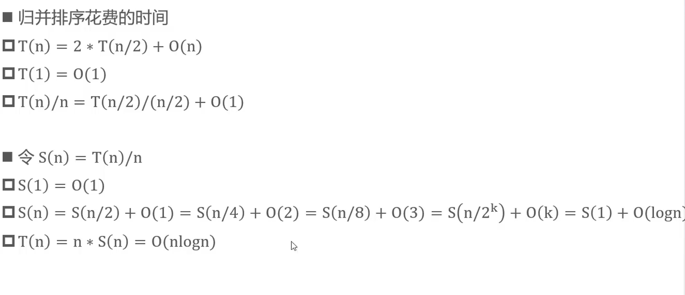

# 算法C++

# 算法C++

## 复杂度


### 时间复杂度

**最佳情况 Ω(1) **： nums = [7, a, b, c, ...] ，即当数组首个数字为 77 时，无论 nums 有多少元素，线性查找的循环次数都为 11 次；
**最差情况 O(N) ：**nums = [a, b, c, ...] 且 nums 中所有数字都不为 77 ，此时线性查找会遍历整个数组，循环 NN 次；
**平均情况 Θ ：** 需要考虑输入数据的分布情况，计算所有数据情况下的平均时间复杂度；例如本题目，需要考虑数组长度、数组元素的取值范围等；


当运行次数与数据无关时，时间复杂度为1


冒泡排序的时间复杂对为O（N^2^）

```C++
vector <int> bubbleSort(vector<int>&nums){
    int N = nums.size();
    for(int i=0;i<N-1;i++){
        for(int j=0;j<N-1-i;j++){
            //将最大的扫到最右边,每次范围减少最右的那个
            if(nums[j]>nums[j+1]){
                swap(nums[j],nums[j+1]);
            }
        }
    }
    return nums;
}
```

二分法, 分治等算法的时间复杂度一般为 O(log N)

快速排序, 归并排序, 堆排序等算法的时间复杂度一般为 O(Nlog N)


### 空间复杂度

**输入空间**：存储输入数据所需的空间大小。

**暂存空间**：算法运行过程中，存储所有中间变量和对象等数据所需的空间大小。

**输出空间**：算法运行返回时，存储输出数据所需的空间大小。

通常情况下，空间复杂度指在输入数据大小为N时，算法运行所使用的 暂存空间 和 输出空间 的总体大小

**指令空间**：编译后，程序指令所使用的内存空间

**数据空间**：算法中的各项变量使用的空间，包括：声明的常量

、变量、动态数组、动态对象等使用的内存空间。

**栈帧空间**：程序调用函数是基于栈实现的，函数在调用期间，占用常量大小的栈帧空间，<u>直至返回后释放</u>。

```C++
//以下代码的空间复杂度为O(1)

int test(){
    return 0;
}

void algorithm(int N){
    for(int i=0;i<N;i++)
        test();

}
```

```C++
//以下代码的空间复杂度为O(N)

int algorithm(int N){
    if(N<=1) return 1;
    return algorithm(N-1) + 1;
}

```

线性O(N)

元素数量与N成线性关系的任意类型集合(常见于 一维数组, 链表, 哈希表等), 都使用线性大小的空间

平方O(N^2^)

矩阵

指数O(2^N^)

二叉树, 多叉树   ( O(m^N^) = O(2^N^) )

对数O(log N)

快速排序

数字转化为字符串


## 高精度运算

### 须知

C++中

- 新的数据类型 string, 可以直接使用 string The_string 创建一个空字符串
- 使用 The_string.length() 获取其长度(不包括'\0')
- 可以使用已被重载的 '+' 进行字符串的合并

```C++
//比较两个数字
int compare(string str1, string str2){
	if(str1.length() > str2.length()) return 1;
	else if(str1.length() < str2.length()) return -1;
	else return str1.compare(str2);
	
} 

//两个正数相加
string add(string str1, string str2){
	
	string ans;
	int len1 = str1.length();
	int len2 = str2.length();
	
	//短的数前面补零，使两个数长一样
	if(len1 > len2){
		for(int i=len1-len2;i>0;i--){
			str2 = '0' + str2;
		}
	}
		
	else if(len1 < len2){
		for(int i=len2-len1;i>0;i--){
			str1 = '0' + str1;
		}
	}
		
//	cout << "str1=" << str1 << '\n';
//	cout << "str2=" << str2 << '\n';	
	
	
	int len = str1.length() - 1;  //下标从零开始计算，所以要减一 
	int carry=0,temp=0;  //carry表示进位的数字
	 
	for(int i=len;i>=0;i--){
//		cout << str1[i]<<'\n';
//		cout << str2[i]<<'\n';
		temp = str1[i] - '0' + str2[i] - '0' + carry;
		carry = temp / 10; 
//		cout << "carry=" << carry <<'\n';
//		cout << "temp=" << temp << '\n';
		temp = temp % 10;
		ans = char('0' + temp) + ans;
	}
	
	if(carry!=0)	ans = char('0'+carry) + ans;
	
	return ans;
	
}  

//两个正数相减（可不大减小） 
string sub(string str1, string str2){
	string ans;
	bool flag = 0; 
	
	//两数相等直接返回 
	if (compare(str1,str2) == 0)  return "0";
	
	//前数比后数小，交换两数位置 
	else if (compare(str1,str2) == -1){
		flag = 1;
		string temp = str1;
		str1 = str2;
		str2 = temp;
	}
//	cout << "str1=" << str1 << '\n';
//	cout << "str2=" << str2 << '\n';
	
	int len1 = str1.length();
	int len2 = str2.length();
	
	//补零 
	for(int i=len1-len2;i>0;i--)
		str2 = '0' + str2;
		
//	cout << "str1=" << str1 << '\n';
//	cout << "str2=" << str2 << '\n';
	
	
	int borrow=0,temp=0;
	for(int i=len1-1;i>=0;i--){
		if((str1[i]-'0'-borrow)-(str2[i]-'0')<0){
			temp = (str1[i]-'0'-borrow+10) - (str2[i]-'0');
//			cout << "borrow=" << borrow << '\n';
//			cout << (str1[i]-'0'-borrow+10) << '-' << (str2[i]-'0') << '=' << temp << '\n';
			borrow = 1;
		}
			
		else{
			temp = (str1[i]-'0'-borrow) - (str2[i]-'0');
//			cout << "borrow=" << borrow << '\n';
//			cout << (str1[i]-'0'-borrow) << '-' << (str2[i]-'0') << '=' << temp << '\n';
			borrow = 0;
		}
		
		ans = char('0'+temp) + ans;
		
	}
	
	//删去前导0	
	ans.erase(0, ans.find_first_not_of('0')); 
	
	if (flag)  return "-" + ans;
	else return ans;
} 


//高精度乘法（需要用到高精度加法） 
string mul(string str1, string str2){
	
	string ans="0";
	
	int len1 = str1.length();
	int len2 = str2.length();
	
	for(int i=len2-1;i>=0;i--){
		int temp = 0; 
		int carry = 0;  //进位数 
		int now_num = str2[i] - '0'; //短数当前计算的数字 
		string str_temp = ""; //用于存放短数每一位计算的和
		
		//是零则跳过 
		if(now_num!=0){
			
			//根据当前数字第几位补零
			for(int j=1;j<=len2-1-i;j++)
				str_temp = str_temp + '0';
			
			
			//短数当前计算的数字去和长数相乘 
			for(int k=len1-1;k>=0;k--){
				temp = (str1[k]-'0')*now_num + carry;
				carry = temp / 10;
				temp = temp % 10;
				str_temp = char('0'+temp) + str_temp; //末位存入和中 
			}
			
			if(carry!=0) str_temp = char('0'+carry) + str_temp;//如果最后还有进位，要加入 
		}

		ans = add(ans,str_temp); //此位乘法结果加进总和中 
	
	}
	
	
	if(ans != "0")	ans.erase(0,ans.find_first_not_of('0'));//删去前导0 
	return ans;
	
} 


//高精度除法（此处为借鉴） (需要用到比较和减法、乘法)
void div(string str1,string str2,string &quotient,string &residue){

	quotient=residue="";//清空 
	
	//除数为0 
	if(str2=="0"){
		quotient=residue="ERROR";
		return;
	}
	
	//被除数为0 
	if(str1=="0"){
		quotient=residue="0";
		return;
	}


	int res=compare(str1,str2);
	//除数大于被除数 
	if(res<0){
		quotient="0";
		residue=str1;
		return;
	}
	
	//除数等于被除数 
	else if(res==0){
		quotient = "1";
		residue = "0";
		return;
	}
	
	else{
		
		int len1=str1.length();
		int len2=str2.length();
		string tempstr;
		tempstr.append(str1,0,len2-1); //被除数从左取到除数位数减一 
		
		for(int i=len2-1;i<len1;i++){
			
			tempstr= tempstr + str1[i];
			tempstr.erase(0,tempstr.find_first_not_of('0'));
			
			if(tempstr.empty())
				tempstr = "0";
				
			//试商 
			for(char ch='9';ch>='0';ch--){
				
				string str,tmp;
				str = str + ch;
				tmp = mul(str2,str);
				
				if(compare(tmp,tempstr)<=0){ //试商成功 
					quotient = quotient + ch;
					tempstr=sub(tempstr,tmp);
					break;
				}
			}
			
		}
		
		residue=tempstr;
	}
	
	quotient.erase(0,quotient.find_first_not_of('0'));
	if(quotient.empty()) quotient="0";
} 


```


## 一些思想

#### 专属值

洛谷P1518 两只塔姆沃斯牛

如何判断陷入死循环？

### 

*我们可以想到，如果两个物体先后两次从同一个方向走到同一个地点，我们就可以说它们陷入了死循环，但如何判断是否是死循环？？这是一个难倒众人的问题。*

```
我们可以通过生成专属值的方法来判断：
农夫的x坐标+他的y坐标 10+奶牛的x坐标* 100+奶牛的y坐标* 1000+农夫的方向* 10000+奶牛的方向* 40000（农夫方向最多为4)
```

即用一个数字来存储,不需要开六维数组,且可以保证每个专属值只可能在相同的情况下出现,一旦重复出现,必定是进入了死循环,由此得出两者无法相遇.


## STL

### vector

可以存放各类型对象的动态数组

*vector<变量类型> 变量名;*

```C++
vector<int> a;

for(int i=0;i<100;i++){
    a[i] = i;
    printf("%d:%d\n", i, a[i]);
}

```

vector<int>  a(100,0)

//100个初始化为0

vector<int> n={1,2,3,5,7,8,9};

所有支持下标访问的容器都可以建立迭代器进行遍历

*容器类型<变量类型>::iterator 变量名;*

```c++
#include <vector>
using namespace std;

//声明一个vector
vector<int> a;
a.push_back(1);//尾部添加元素
a.push_back(3);
a.push_back(4);
a.push_back(2);

//定义迭代器
vector<int> :: iterator it;
for(it = a.begin();it != a.end(); it++){
    pritnf("%d ",*it);
}

for(int i=0;i<a.size();i++) cout<<a[i];
```

### pair

*pair<变量类型1,变量类型2> 变量名;*

```C++
#include <utility>
using namespace std;
pair<int,int> p(1,2);
cout<<p.first<<' '<<p.second;

///
vector<pair<string,double> > a;
pair<string,double> p;
p.first = "c++";
p.second = "100.00";
a.push_back(p);//不能a[0] = p;
//继续压入
    
//迭代
vector<pair<string,double>> :: iterator it;
for(it = a.begin();it != a.end();it++){
    cout << (*it).first << ' ' << (*it).second;
    cout << '\n';
}
```

### map

*map<变量类型1,变量类型2> 变量名;*

从key映射到value

key是唯一的,但value可以重复

```C++
#include <map>
using namespace std;

map<int, int> mp;
mp[1] = 2;
mp[2] = 4;
mp[3] = 8;
mp[2] = 2;//会覆盖之前的映射关系

map<string, int> mp1;
mp1["asd"] = 1;
mp1["cgg"] = 3;
mp1["asd"]++;//此时mp1["asd"] == 2;

map<int, int> :: iterator it;
for(it = mp.begin();it != mp.end();it++){
    cout<<(*it).first<<" "<<(*it).second;
    //map会按照变量1的名称的字典序/数值大小排序
}
```


## 基础数据结构

### 栈

先进后出/后进先出 的 线性结构

#### **STL**模板

|功能|操作|
| :----------: | :-----------------: |
|创造新栈|stack<类型名>变量名|
|入栈|push()|
|出栈|pop()|
|访问栈顶|top()|
|判断是否为空|empty()|
|栈高|size()|

#### **后缀表达式**

> 所谓**后缀表达式**是指这样的一个表达式：式中不再引用括号，运算符号放在两个运算对象之后，所有计算按运算符号出现的顺序，严格地由左而右新进行（不用考虑运算符的优先级）。
>

如：3*(5–2)+7对应的后缀表达式为：3．5．2．-*7．+@。’@’为表达式的结束符号。‘.’为操作数的结束符号。

*有数字就放进栈,遇到符号就拿出栈顶的两个数字按先放到后放的顺序进行操作,然后把结果放回栈中*

```C++
int main(){
    string a; //最好不要一个一个字符读入
    cin >> a;
    stack<int> s;
    int x=0,y=0;
    
    for(int i = 0;i < a.size();i++){
        if (isdigit(a[i])) x = x*10 + a[i] - '0';
        //把数字读入,多个位数则值左移然后再加
        else if(a[i]=='.') s.push(x), x = 0;
        else if(a[i]=='@') break;
        else{
            y = s.top(),s.pop();
            x = s.top(),s.pop();
            switch(a[i]){
                case '*':s.push(x*y);break;
                case '+':s.push(x+y);break;
                case '-':s.push(x-y);break;
                case '/':s.push(x/y);break;
            }
            x = 0; y = 0;
        }
    }
    
    cout << s.top() << '\n';
    return 0;
}
```


### 队列

先进先出的线性结构

#### STL模板

|功能|操作|
| :----------: | :-----------------: |
|创建新队列|queue<类型名>变量名|
|入队|push(队列元素)|
|出队|pop()|
|访问队首|front()|
|判断是否为空|empty()|
|队长|size()|

例题:洛谷P1540


```C++
int n,m;
queue<int> q;
bool inq[maxn]; //桶排序,题目数量只有1000
int main(){
    cin >> m >> n;
    int cnt=0;
    for(int i=1;i<=n;i++){
        int tmp;
        cin >> tmp;
        if(!inq[tmp]){
            cnt++;
            q.push(tmp);
            inq[tmp] = true;
            if(q.size()>m)
                inq[front] = false,q.pop();
        }
    }
    cout << cnt << '\n';
    return 0;
}


```


### 堆

#### 完全二叉树的线性表示

二叉树:一个节点只能有两条边

满二叉树:每一层都达到最大值

完全二叉树:满二叉树丢掉最后面的连续几个节点


#### 堆的维护

删去:某个的a和最后的e互换,然后e不断和左右之中最大的换位,最后舍弃末尾的a

增加:最后的e和父点比较,若比他大则互换

**操作**

1.*shift_up

2.*shift_down

3.入堆

4.出堆

5.访问堆顶

6.判断堆是否为空

#### 优先队列

|功能|操作|
| :------------: | :--------------------------: |
|创建新优先队列|priority_queue<类型名>变量名|
|入队|push(队列元素)|
|出队|pop()|
|访问队首|top()|
|判断是否为空|empty()|
|队长|size()|

1.默认为大根堆(大顶堆)


3.若要定义为小根堆:priority_queue <int, vector < int > , greater< int >> //int 也可换为其他类型


## 前缀和

### 差分数组

```
d[i]=a[i]-a[i-1]

也有 a[i]=a[i-1]=d[i]
```

**修改区间**时（如第3到6项+2，第5到8项-9）

对差分数组，

区间的左端为相同变化，右端为相反变化，区间内其他值不变。


x(mod i)=x-x 整除 i * i

#### 二维差分数组

```
//确定一个左上点(1,1)为原点
sum[i][j]=sum[i-1][j]+sum[i][j-1]-sum[i-1][j-1]+a[i][j]

//在上述情况下求以一个任意点(i,j)为左上点,边长为c的正方形的数字和
tot[i][j]=sum[i+c-1][j+c-1]-sum[i-1][j+c-1]-sum[i+c-1][j-1]+sum[i-1][j-1]

```


## 二分

对于有序序列,查找位置

O(logN)

**思路:**

令begin=0(起始位置),end=size+1(实际末位加一)

- 假设在[begin,end)搜索v,mid==(begin+end)/2
- 如果v<m,去[begin,end)继续搜索;如果v>m,去[mid,end)继续搜索
- 如果v==m,直接返回mid

```C++
//板子1:从0开始计数 范围[l,r] 最后l==r==mid,且找到大于等于xx的第一个数
int xx;
cin>>xx;
int l=0,r=n-1;
while(l<r){
    int mid=(l+r)/2;//下取整,否则会死循环
    if(a[mid]>=xx) r=mid;   
    //符合条件->区间向左,且下取整,则最后查出的在最左
    else l=mid+1;
}

//板子2:同上,但找到大于等于xx的最后一个数
int xx;
cin>>xx;
int l=0,r=n-1;
while(l<r){
    int mid=(l+r+1)/2;  //上取整,否则会死循环
    if(a[mid]<=xx) l=mid;
    //符合条件->区间向右,且上取整,则最后查出的在最右
    else r=mid-1;
}
```

```C++
#include <bits/stdc++.h>
using namespace std;


int Indexof(vector<int> num,int n){
    if(n.size()==0)	return -1;
	int begin = 0;//左闭右开 
	int end = num.size();//vector获取元素数量方便 
	while(begin<end){
		int mid = (begin + end)>>1;
		if(n < num[mid]){
			end = mid;
		}
		else if(n > num[mid]){
			begin = mid + 1;
		}
		else{
			return mid;
		}
		
	}
	
	return -1;
} 

int main(){
	vector<int> n={1,2,3,5,7,8,9,100,200};
	cout << Indexof(n,12);
	return 0;
} 
```


## 排序

b站课程:https://www.bilibili.com/video/BV1PT4y13767

动画演示:https://www.cs.usfca.edu/~galles/visualization/ComparisonSort.html

**稳定性**

如果相同的两个元素,在排序前后的相对位置不变,则该排序算法是稳定的

**原地算法(In-place Algorithm)**

不依赖太多的额外资源,仅靠输出来覆盖输入

空间复杂度O(1)一般为原地算法




SWAP的宏定义:

```CPP
#define SWAP(x,y,t) ((t)=(x),(x)=(y),(y)=(t))
```

COMPARE的宏定义

```C++
#define COMPARE(x,y) ( ((x)<(y))? -1: ((x)==(y))? 0:1 )
```


### 冒泡排序（Bubble Sort）

时间复杂度:Ω(N)   O(N^2^)

空间复杂度:O(1)

稳定的排序算法

从头到尾比较两个数，如果左比右大，则交换两者位置（结果是最大的会放在最有），然后缩小下一轮扫描的范围（即排除最右的），这样会不断把大的放在右边，直到变成升序。

```C++
int n[N];

for(int i=N-1;i>=0;i--){
    for(int j=1;j<=i;j++){
        
        if(n[j-1]>n[j]){
            int temp = n[j];
            n[j] = n[j-1];
            n[j-1] = temp;
        }
        
    }
}
```

**优化①**

如果已经完全有序（一轮扫描没有交换），提前终止

然而如果数据量大，没有出现提前有序，则此方法并无法优化

```C++
int n[N];

for(int i=N-1;i>=0;i--){
    bool sorted = 1;
    for(int j=1;j<=i;j++){
        
        if(n[j-1]>n[j]){
            int temp = n[j];
            n[j] = n[j-1];
            n[j-1] = temp;
            sorted = 0;
        }
    }
    if(sorted) break;
}
```

**优化②**

尾部已经局部有序，可以记录最后一次交换的位置，减少比较次数

```C++
int n[N];

int sort_index;
for(int i=N-1;i>=0;i--){
    sort_index = 1; //如果完全有序,后面会直接退出
    for(int j=1;j<=i;j++){
        
        if(n[j-1]>n[j]){
            int temp = n[j];
            n[j] = n[j-1];
            n[j-1] = temp;
            sort_index = j;
        }
    }
    i = sort_index;
}
```


### 选择排序(Selection Sort)

选择排序的交换次数要远远少于冒泡排序,平均性优于冒泡排序.

时间复杂度:Ω(N^2^)  θ(N^2^)  O(N^2^)

空间复杂度:O(1)

不稳定排序

扫描找出最大的元素,并把它放在最右

下一轮扫描排除最右元素,重复上述步骤

```C++
int n[N];

for(int i=N-1;i>=0;i--){
    int maxIndex = 0;
    for(int j=1;j<=i;j++){
        if(n[maxIndex]<=n[j]) //包含等于是为了增加稳定性,但还是可能不稳定,如: 7 5 10 10 2 4 2*(10放最后会把2*交换到2左边)
            maxIndex = j;
    }
    
    int tmp = n[maxIndex];
    n[maxIndex] = n[i];
    n[i] = tmp;
}
```


### 堆排序（Heap Sort）

优化选择排序时找最大值的做法，使用大顶堆（O（logn））

时间复杂度： O（NlogN）

执行流程：

- 对序列进行原地建堆（heapify）
- 重复执行以下操作，直到堆的元素数量为1
  - 交换堆顶元素与尾元素
  - 堆元素数量减一
  - 堆0位置进行一次shiftdown操作

```C++
//使用STL中的优先队列实现大根堆的创建和自动维护

priority_queue <int,vector<int>,greater<int>> q;

int N,temp;
cin >> N;
for(int i=0;i<N;i++){
    cin >> temp;
    q.push(temp);
}

```


### 插入排序（Insertion Sort）

时间复杂度: Ω(N)  O(N^2^)  θ(N^2^)

空间复杂度: O(1)

稳定的排序

流程：

- 将序列分为头部（已排序）和尾部
- 从头开始扫描每一个元素，将它插入到头部合适的位置，使头部依然有序

```C++
int N;
int num[N];

for(int begin=1;begin<N;begin++){
    for(int end=begin;end>0;end--){
        if(num[end]>=num[end-1])
            break;
        int temp = num[end];
        num[end] = num[end-1];
        num[end-1] = temp;        
    }    
}
```

#### 逆序对

<2,3,8,6,1> 中的逆序对为:<2,1>,<3,1>,<8,6>,<8,1>,<6,1>

- 插入排序的时间复杂度与逆序对数量成正比

优化:将交换改为挪动

- 将待插入的元素备份
- 头部有序数据中比待插入元素大的,都朝尾部挪动一个位置
- 将待插入元素放到最终合适的位置

```C++
int N,num[N];

for(int begin=1;begin<N;begin++){
    int nowNum = num[begin];
    int end = begin;
    while(end>0 && nowNum<num[end-1]){
        		 //不是num[end]<num[end-1]
        num[end] = num[end-1];
        end--;
    }
	num[end] = nowNum;
}


```

#### 二分优化

在查找插入位置时使用二分搜索,返回第一个大于当前数字的元素的位置

然而还是要挪动,所以时间复杂度还是O(n^2^)

使用左闭右开的好处:

- end-begin就是元素的数量
- mid一直是(begin+end)>>1

自己写的

```C++
#incldue <bits/stdc++.h>
using namespace std;

int Insert_index(vector<int> n,int v){
    if(n.size()==0)	return -1;
    int begin = 0;
    int end = n.size();
    
    while(begin<end){
        int mid = (begin+end)>>1;
        if(v < n[mid]){
            end = mid;
        }
        
        else{  //v>=n[mid]的情况,这样最后可以找到第一个大于的数字索引
/*
如果把等于归入到上面的if,则会找到最后一个大于等于的数字索引
*/
            begin = mid + 1;
        }
    }
    
    return end; //此时end和begin相等
}


int main(){
    vector<int> n;
	int N,temp;
	cin >> N;
	for(int i=0;i<N;i++){
		cin >> temp;
		n.push_back(temp);
	}
	
	vector<int> t;
	t.push_back(n[0]);
	//二分优化后的插入排序
	for(int begin=1;begin<N;begin++){
		
		int nowNum = n[begin];
		t.push_back(nowNum);
		
		//cout << begin << ':' << nowNum << '\n';
		int index = Insert_index(t,nowNum);
		//cout << "index = " << index << '\n';
		
		for(int end=begin;end>index;end--)
			t[end] = t[end-1];
		
		t[index] = nowNum;
		
		//for(int i=0;i<t.size();i++)
	 	//	cout << t[i] << ' ';
	 	//	
	 	//cout << '\n';
	} 
	
	for(int i=0;i<t.size();i++)
		cout << t[i] << ' ';
    
    return 0;
}


```

网课版本

```C++
#include <bits/stdc++.h>
using namespace std;

//传入索引的好处是信息多:索引指向的数字,索引前面的所有数字已经有序
int Insert_index(vector<int> n,int index){
    int begin = 0;
    int end = index;
    
    while(begin<end){
        int mid = (begin+end)>>1;
        if(n[index]<n[mid]){
            end = mid;
        }
        else{
            begin = mid + 1;
        }
        
    }
    
    return begin;
}


int main(){
	vector<int> n;
	int N,temp;
	cin >> N;
	for(int i=0;i<N;i++){
		cin >> temp;
		n.push_back(temp);
	}
	
    for(int begin=1;begin<n.size();begin++){
        int nowNum = n[begin];
        int index = Insert_index(n,begin);
        
       	for(int end=begin;end>index;end--)
            n[end] = n[end-1];
            
        n[index] = nowNum;
    }
    
    for(int i=0;i<n.size();i++)
		cout << n[i] << ' ';
    
	return 0;
}


```


### 希尔排序(Shell Sort)

时间复杂度: Ω(N)    θ(N^4/3^~N^2^)

空间复杂度: O(1)

不稳定的排序

把序列看作一个矩阵,分为m列,逐列进行排序(逆序对逐渐减少), m逐渐减到1, 排序时底层使用的是插入排序

因此也被成为递减增量序列(Diminishing Increment Sort)

m取决于步长,可以自己生成一个步长序列(希尔自己给出的是 N/2^k^), 如N=32时,步长为{32, 16, 8, 4, 2, 1}

```C++
vector<int> step;
int t=N;
while((t>>=1)>0)
	step.push_back(t);
```

目前最好的步长序列:

k = 0,1,2,...   直到k>N(元素数量)


第col列 第row行 步长为step

同列元素索引 = col + row * step

```C++
#include <bits/stdc++.h>
using namespace std;

// 对[begin, end) 进行排序 
void ShellSort(int arr[], int begin, int end){
	// 创建一个可变数组，并创建步长序列 
	vector<int> step;
	int t=end;
	while((t>>=1)>0)
		step.push_back(t);
	
//	for(int i=0;i<step.size();i++)
//		cout << step[i] << '\n';
//	cout << step.size() << '\n';

	//  根据步长划分列 
	for(int si=0;si<step.size();si++){
		int st = step[si];
		
		// 对于每一个步长序列对应的列单独进行 插入排序
		for(int col=0; col<st; col++){
			
			// 当前新加入的元素 
			for(int bg = col + st; bg<end; bg+=st){
				// 将当前新加入的元素不断交换到合适位置 
				for(int cur = bg; cur>0; cur -= st){
					if(arr[cur] >= arr[cur - st])
						break;
					
					int temp = arr[cur];
					arr[cur] = arr[cur - st];
					arr[cur - st] = temp;
				}	
				
			}
		
		}
	}
}


int main(){
	
	int N;
	cin >> N;
	
	int num[N+5];
	for(int i=0;i<N;i++)
		cin >> num[i];
	
	ShellSort(num, 0, N);
	
	for(int i=0;i<N;i++)
		cout << num[i] << ' ';
	
	return 0;
}

```


### 归并排序（Merge Sort）

空间复杂度: O(N/2+logN) = O(N)

时间复杂度: Ω(NlogN) O(NlogN)  θ(NlogN)  (每一层归并的时间复杂度为O(N),最多有logN + 1层

稳定的排序

实际上速度比堆排序快



- divide: 不断将当前序列平均分 割成2个子序列，直到不可再分（序列元素为1）
- merge: 不断将2个子序列合并成一个有序序列，直到剩下1个有序序列

最初两个索引分别指向两个序列的头部，进行比较，小的放进合并后的序列中，并且索引向后移动一个位置

但是实际上两个序列是存在于同一个数组且挨在一起，而且合并后的序列要覆盖原数组

为了更好地进行merge，可以将其中1组序列备份出来，比如 [begin,mid)

左边是备份的数组,右边是原来的大序列

右边提前结束,则将左边挪到右边

左边提前结束,则不用挪右边(因为本来就在右边)

一开始就根据最大序列的一半来分配空间

```C++
#include <bits/stdc++.h>
using namespace std;

void merge (int arr[], int tempArr[], int begin, int mid, int end){
	// 将 [begin, mid) 和 [mid, end) 范围的序列合并成一个有序序列 
	
	int cnt=0;
	// 将作左半区备份给tempArr
	for(int i=begin;i<mid;i++)
		tempArr[cnt++] = arr[i];
		
	
	// 左半区索引(li为左半区第一个未排序元素,le为末尾) 
	int li = 0, le = cnt;
	// 右半区索引(ri为右半区第一个为排序元素,re为末尾) 
	int ri = mid, re = end;
	// 当前覆盖索引 
	int ai = begin;
	
	// 排序合并 
	while(li<le && ri<re){
		
		if(tempArr[li] <= arr[ri]) //左边小于等于才稳定
		{
			arr[ai++] = tempArr[li++];

		}
		
		else
		{
			arr[ai++] = arr[ri++];
		}

	}
	
	// 右边提前完成则将左边的元素挪动到右边
		while(li<le && ai<end)
			arr[ai++] = tempArr[li++];

	// 左边提前完成则不用再操作 
	
    //排序合并和最后挪动可简化写为：
  /*
    while(li<le){
    	if(ri<re && arr[ri] < tempArr[li]) //这样等于的情况也会用左半区的元素，保持稳定性
    		arr[ai++] = arr[ri++];
    
    	else
    		arr[ai++] = tempArr[li++];
    }
    
    
  */  
    
}

// 对 [begin,end) 范围内的元素进行排序 
void msort (int arr[], int tempArr[], int begin, int end){
	// 元素数量必须大于1 
	if(end - begin < 2) return;
	
	// 求出中间索引 
	int mid = (begin + end) >> 1;
	
	// 递归划分左半区
	msort(arr, tempArr, begin, mid);
	// 递归划分右半区
	msort(arr, tempArr, mid, end);
	// 合并已经排序好的左右半区 
	merge(arr, tempArr, begin, mid, end);

	
} 


// 归并排序 
void Merge_sort(int arr[], int n){
	// 分配一个辅助数组
	int *tempArr = (int*) malloc((n>>1)* sizeof(int));
	
	if(tempArr) // 辅助数组分配成功 
	{
		msort(arr, tempArr, 0, n);
		free(tempArr);
	}
	
	else printf("error: failed to allocate memory");
	
} 


int main(){
	
	int n[10] = {12,4,11,3,66,42,26,0,5,33};
	Merge_sort(n,10);
	
	for(int i=0;i<10;i++)
		cout << n[i] << ' ';
	
	
	return 0;
}


```


### 快速排序(Quick Sort)

时间复杂度: Ω(NlogN)  O(NlogN)  θ(N^2^)

空间复杂度: O(logN)

可稳定的排序

流程:


一般选择begin作为轴点元素,先将轴点元素备份,先从end(此时end是有元素的位置)向左扫描,如果找到比轴点元素大的,直接end--(向右扫描同理);如果找到比轴点元素小的,直接覆盖begin的位置(即已经备份的元素位置).

轴点元素的位置被覆盖 后,每次end--或者begin++后就调换扫描方向.(这时候需要将元素覆盖到另一边时会覆盖到无用的元素(黑色所示, 因为该元素已经覆盖到其他位置了))


最坏情况会O(n^2^)

避免方法:

- 轴点随机（只需要将随机下标的元素与首元素交换）
- 相等的情况也交换到对面，并且切换扫描方向（这样可以让左右半区相对均分，尽可能同时缩小子序列的长度）

```C++
#include <bits/stdc++.h>
using namespace std;


/**
 * 构造出 [begin,end) 范围的轴点元素 
 * @return 轴点元素的最终位置 
 */
int PivotIndex(int arr[], int begin, int end){
	
	//将随机下标的元素与首元素交换
	int randIndex = begin + rand()%(end-begin);
	//printf("\n**\nbegin:%d end:%d rand:%d\n**\n",begin,end,randIndex); 
	int temp = arr[randIndex];
	arr[randIndex] = arr[begin];
	arr[begin] = temp;
	
	
	// 备份begin位置的元素 
	int pivot = arr[begin];
	
	//需要让end指向最后一个元素 
	end--;
	
	while(begin<end){
		
		// 双while写法可以让两部分交替使用 
		while(begin<end){
			if(arr[end]>pivot){
				end--;
			}
			else{ // 执行else时(包括等于的情况，增加效率)就要改变扫描方向，于是break 
				arr[begin++] = arr[end];
				break;
			}
		}
		
		
		while(begin<end){
			if(arr[begin]<pivot){
				begin++;
			}
			else{
				arr[end--] = arr[begin];
				break;
			}
		}
		
	}
	
	arr[begin] = pivot;
	return begin;
}


/**
 * 对 [begin,end) 进行快速排序 
 */

void QuickSort(int arr[], int begin, int end){
	
	if(end - begin < 2) return; 
	
	// 确定轴点位置
	int mid = PivotIndex(arr, begin, end); 
	
	// 对子序列进行快速排序 
	QuickSort(arr, begin, mid);
	QuickSort(arr, mid+1, end);
	
}


int main(){
	
	
	int N;
	scanf("%d", &N); 
	
	int num[N+5];
	for(int i=0;i<N;i++)
		scanf("%d", &num[i]);
	
		
	QuickSort(num, 0, N);
	
	for(int i=0;i<N;i++)
		printf("%d ", num[i]);
	
	
	return 0;
}

```

> 之前的排序都是基于比较的排序,最低的平均时间复杂度为O(NlogN)
>
> 之后的排序不是基于比较的排序,以空间换时间,适合对一定范围内的整数进行排序
>


### 计数排序(Counting Sort)

统计所有数字出现的次数, 数组长度为最大数+1

```C++
#include <bits/stdc++.h>
using namespace std;

int main(){
	int N;
	cin >> N;
	int arr[N+5];
	for(int i=0;i<N;i++)
		cin >> arr[i];
	
	//找出最大的数字
	int max = arr[0]; 
	for(int i=1;i<N;i++){
		if(max < arr[i])
			max = arr[i];
	}
	
	int cnt[max+1] = {0};
	
	for(int i=0;i<N;i++)
		cnt[arr[i]]++;
	
	int index = 0;
	for(int i=0;i<max+1;i++){
		while(cnt[i]-- > 0)
			arr[index++] = i;
	}
	
	for(int i=0;i<N;i++)
		cout << arr[i] << ' ';
	
	return 0;
}
```

存在的问题:

- 无法对负整数/其他数据类型进行排序
- 有大量浪费的空间
- 不稳定

找出最小值,数组大小为 max-min+1  (左闭又闭)

cnt数组元素累加前面索引所有元素(可以保存位置信息),创建新的数组,从右往左遍历原数组(保证稳定性),出现的数字作为索引访问cnt,得到的元素减1就是数字应该存放在新的数组的索引

```cpp
//时空复杂度： O(N+k)
//稳定的排序
#include <bits/stdc++.h>
using namespace std;

int main(){
	int N;
	cin >> N;
	int arr[N];
	for(int i=0;i<N;i++)
		cin >> arr[i];

	// 找出最大的数字和最小的数字 
	int max = arr[0],min = arr[0]; 
	for(int i=1;i<N;i++){
		if(max < arr[i])
			max = arr[i];
		
		if(min > arr[i])
			min = arr[i];
	}

	// 创建计数数组 
	int cnt[max-min+1] = {0};

	// 计数 
	for(int i=0;i<N;i++)
		cnt[arr[i]-min]++;

	// 累加
	for(int i=1;i<max-min+1;i++)
		cnt[i] += cnt[i-1];

	// 答案数组 
	int ans[N];
	for(int i=N-1;i>=0;i--){ // 从右往左才能保证稳定性 
		ans[--cnt[arr[i]-min]] = arr[i]; // arr[i]是找到的数字 
	}


	for(int i=0;i<N;i++)
		cout << ans[i] << ' ';


	return 0;
}
```


### 基数排序（Radix Sort）

时间复杂度： O(d*(n+k))，d为最大位数，k是进制，稳定排序

空间复杂度： O（n+k），k是进制

适合对非负整数进行排序

从低位向高位排序（个位，十位，百位，万位...），相当于针对每一位进行一次稳定的计数排序


```cpp
#include <bits/stdc++.h>
using namespace std;

int main(){

	int N;
	cin >> N;
	int arr[N];
	for(int i=0;i<N;i++){
		cin >> arr[i];
	} 

	int max = arr[0];
	for(int i=0;i<N;i++){
		if(max < arr[i])
			max = arr[i];
	}
	
	// 答案数组 
	int ans[N],divider;

	for(divider = 1;divider <= max;divider *= 10){
		// 创建计数数组 
		int cnt[10] = {0};

		// 计数 (应该是对已经更新过的arr，而不是最初的arr)
		for(int i=0;i<N;i++)
			cnt[arr[i] / divider % 10]++;

		// 累加
		for(int i=1;i<10;i++){
			cnt[i] += cnt[i-1];
		}

		for(int i=N-1;i>=0;i--){ // 从右往左才能保证稳定性 
			ans[--cnt[arr[i] / divider % 10]] = arr[i]; // arr[i]是找到的数字 
		}

		// arr需要更新一下 
		for(int i=0;i<N;i++)
			arr[i] = ans[i];

	}

	for(int i=0;i<N;i++)
			cout << ans[i] << ' ';

	return 0;
}

```


### 桶排序(Bucket Sort)

空间复杂度: O(n+m), m为桶的数量

执行流程:

* 创建一定数量的桶(数组/链表)
* 按照一定的规则(不同类型的数据,规则不同且不唯一),将序列中的元素均匀分配到对应的桶
* 分别对每个桶进行单独排序
* 将所有非空桶的元素合并成有序序列


元素在桶中的索引举例

* 元素值*元素数量


## 搜索

### 广度优先搜索

#### 使用邻接表存图

**无权图**

```C++
vector <int> mp[10];
mp[1].push_back(2);
mp[1].push_back(3);//表示1可以走到2和3;
mp[2].push_back(1);
mp[2].push_back(7);//表示2可以走到1和7;
```

```C++
//n个点,m条无向边,图的遍历
int n,m;
cin>>n>>m;
for(int i=1;i<=m;i++){
    int st,ed;
    cin >> st >> ed;
    mp[st].push_back(ed);
    mp[ed].push_back(st);
}

queue<int> q;
q.push(1);

while(q.size()){
    int now = q.front();
    q.pop();
    for(int i = 1;i <= mp[now].size();i++){
    	int to = mp[now][i];
        q.push(to);
    }
}
```

**有权图**

```c++
vector <pair <int,int> > e[N];
vector <pair <int,int> > :: iterator it;
for(int i = 1,x,y,z;i<=m;i++){
    cin>>x>>y>>z;
    e[x].push_back({y,z});  //x为起点,y为终点,z为权值
    e[y].push_back({x,z});//若是有权无向图,则存两遍即可.
}


//遍历以a为起点的每一条边
for(it=e[a].begin();it!=e[a].end();it++){
    
    int v = it.first, w = it.second;
}
```


### 深度优先搜索

#### 剪枝

##### 一.记忆化

如果同一个点的值是不变的,可以把已经计算过的保存下来,下一次遍历可直接调用这个值.

```c++
//数楼梯
#include <bits/stdc++.h>
using namespace std;
const int N = 5005;
int n,f[N];
bool v[N];

int dfs(int i){
    if(v[i]) return f[i];
    v[i] = 1;
    f[i] = dfs(i-1)+dfs(i-2);
    return f[i];
}

int main(){
    cin >> n;
    f[0] = 1;f[1] = 1;
    v[0] = 1;v[1] = 1;
    cout<< dfs(n) <<endl;
    return 0;
}
```


## 动态规划

 做题思路：

* 确定状态：

  * 研究最优策略的最后一步
  * 转化为子问题
* 转移方程

  * 根据子问题定义得到
* 初始条件和边界情况

  * 应该初始化与边界相邻且没办法由转移方程算到的情况
* 计算顺序

  * 核心：利用之前计算的结果

动态规划与递归的区别：

* 同样是面对子问题，动态规划存储结果，并且不断利用之前计算过的结果
* 动态规划一般只能求出最值，而不能把方案具体表现出来


### 例1.取硬币问题

现在有2，5，7元三种硬币若干，需要取27元，最少需要几个硬币？

7+7+7 = 21  21+2+2+2 = 27   所以是6枚？

错。答案是  7+7+5+5+5+5 = 27  共5枚

并不是简单的贪心。


一、确定状态

最优策略，取最后一枚硬币，达到27元

设为n元需要的最少硬币数为F（n）

则最后一步F(27) = min{F(27-2)+1, F(27-5)+1, F(27-7)+1}


二、转移方程

F(n) = min{F(n-A[i])}

其中A存储硬币种类，A[] = {2, 5, 7}, i从0到2


三、初始化和边界情况

当k<0时，无法取得，因此定义F(k) = 无穷大 （本题其实也可以定义为28）

当k=0时，刚好取得，因此定义F(0) = 0；


四、计算顺序

从小到大计算


```CPP
#include <bits/stdc++.h>
using namespace std;
const MAX_INT = 0x7fffffff

int main(){
    int n, M;
    int i, j;
    scanf("%d%d", &n, &M);
    for(i=0; i<n; i++)
        scanf("%d", &A[i]);
  
    int F[n+1]={0, };  // 一定要是n+1，因为包含F[0]
  
    for(i=1; i<=M; i++){
        F[i] = MAX_INT;
        for(j=0; j<n; j++){
            if(i-A[j] >= 0 && F[i-A[j]] != MAX_INT)
                F[i] = min(F[i-A[j]], F[i]);
        }
    }
  
    if(F[M] == MAX_INT)
        F[M] = -1;

    printf("%d", F[M]);
    return 0;
}
```


### 例2.方格移动

有一个N*M的方格，人初始在（0，0）处，

每次移动只能向右一格（+0，+1）或者向下一格（+1，+0）

问到达（N-1，M-1）一共有几种方法？


一、确定状态

到（N-1，M-1）处前一步是到达（N-2，M-1）或者（N-1，M-2）

因此（N-1，M-1）的方法总数是后两者总数之和

即F[N-1][M-1] = F[N-2][M-1] + F[N-1][M-2]


二、转移方程

F[i][j] = F[i-1][j] + F[i][j-1]


三、初始化

最上一行和最左一列均为1


四、计算顺序

从左上往右下


```CPP
#include <bits/stdc++.h>
using namespace std;

int main(){
    int n, m;
    scanf("%d%d", &n, &m);
  
    int F[n][m];
    int i, j;
    for(i=0; i<n; i++){
        for(j=0; j<m; j++){
            if( i==0 || j==0)
                F[i][j] = 1;
            else    F[i][j] = F[i-1][j] + F[i][j-1];
        }
    }

    printf("%d", F[n - 1][m - 1]);

    return 0;
}
```


### 例3.青蛙跳石子问题

有n个石子各自放在数轴上（0 ~ n-1）

青蛙在某一点上最多向右跳跃a~i~格

问青蛙能否到达石头n-1


一、确定状态

青蛙到达n-1 需要从 第i个跳过来（i < n-1）

包含两个意思：

* 青蛙能到达i
* 青蛙在i处跳跃距离足够到达n-1


二、转移方程

设F[i]

为1表示能到达第i石头，为0表示不能到达第i块石头

则 F[i] = OR(F[j] && j + a[j] >= i )    (j为 0 ~ i-1)


 三、初始化

F[0] = 1


四、计算顺序

从左到右


```CPP
#include <bits/stdc++.h>
using namespace std;

int main(){
    int n;
    scanf("%d", &n);
  
    int i, j, a[n];
    bool F[n] = {true, };
    scanf("%d", &a[0]);

    for(i=1; i<n; i++){
        scanf("%d", &a[i]);
    
        for(j=0; j<i; j++){
            if(F[j] && j+a[j] >= i){
                F[j] = true;
                break;
            }
        }
    }
  
    return 0;
}
```
